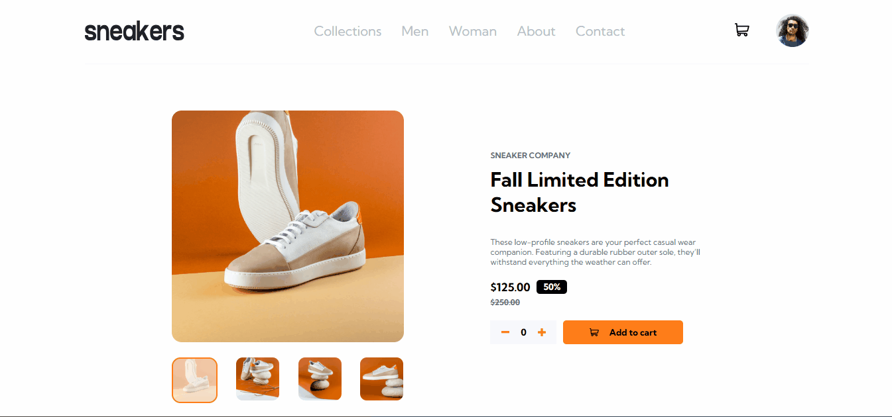
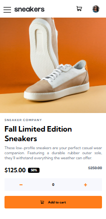

# E-commerce | Sneakers

👀 Venha dar ver o projeto funcionando !
[E-commerce](https://e-commerce-sneakers-83ck9lthh-tcdesenvolvedorwebs-projects.vercel.app)

## 🤔 Sobre o projeto

🗣️ Este projeto em formato de SPA, (Single page aplication), se trata da página de apresentação de um produto, que conta com funcionalidades como o carrinho, slider de imagens e outros.

🏃‍♂️‍➡️ O objetivo deste projeto era a de consolidação do meus aprendizado, pois eu acredito que praticar faz com que a mente grave as ações, pois passamos tempo pensando nas soluções para certos problemas, inclusive, não só gravar, mas sim de fato aprender, pois em muitas ocasiões quando estamos aprendendo algo, topamos com uma dificuldade ou dúvida, nessa parte onde poderiamos ficar fustrado por não conseguir, é onde vamos fazer pesquisas, seja em uma documentação ou perguntando para alguém que sabe mais que você, essa ajuda que você consegue, acaba por gerar uma marca importante na sua memória, coisa que não aconteceria simplmente assistindo uma aula, onde apesar de fazer anotações e praticar junto do professor, você não está pondo em prática as coisas que vem da sua cabeça, mas sim algo que já esta pronto e mastigado.

## 📋 Funcionalidades

🛒 Carrinho de compras;

🧮 Calculo do valor dos proutos;

🔢 Contador de quantiade dos produtos a serem adicionados;
 
🍔 Menu Hambúrguer;

🖱️ Botões clicáveis: Adicionar ao carrinho, mais, menos, lixeira , setas para passar as imagens, imagens correspondentes...

🖼️ Slider;

## 🛠️ Ferramentas

- React com vite;

- Context API;

- Mitt;

- Styled-components;

- Git;

- Hooks;

## 💻 Tecnologias 

- JavaScript;

## 🏆 Desafios

Alguns dos principais desafios foram:

❗ Eu precisava que ao clicar em adicionar ao carrinho, a página renderizasse novamente, porque se não, eu não conseguiria adicionar ao carrinho  mesm quntidade de produtos mais uma vez, teria que ser ou mais ou menos, mas foi aí que eu pensei em criar um gatilho, que ao clicar no botão de adicionar ao carrinho, fosse ativado, mas como, foi aí que eu descobri o mitt, ele permite essa interação entre funções de outros componentes, ele se baseia em esperar e escutar, básicamente ser um Listner / ouvinte , que no momento em que ativamos uma função em um componente, ele capta e avisa no outro componente, "Olha, o botão lá foi clicado, agora é sua vez.". como usa-lo?

    //instale o mitt

    npm install mitt

    // component que irá ser ativado

    import mitt from "mitt";
    const eventBus = mitt();

    const MyComponent = () => {
        const MyFunction = () => {
            eventBus.emit('botão clicado' , true );
        }
    }

    Export { eventBus };

    // outro component
    import mitt from "mitt";
    import { eventBus }  from "../MyComponent";

    const MyComponent = () => {
        Effect(()=>{
            const listner = (ativado) => ativado && "função desejada";

            eventBus.on('botão clicado' , listner);
            return () => eventBus.off('botão clicado' , listner);
        },[])
    }

Obs: Muito importante que quando usar funções que envolvam o global do seu código, após o seu uso sejá desmontado, para evitar vazamento de dados ou outros problemas.

❗O outro problema foi com as setas que deveriam sumir em telas maiores, mas como fazer isso sem afetar o css? foi aí onde entrou o window.innerHeight e window.innerWidth, eu criei um hook bem simples, chamado useWindowSize, que me permitia usa-lo como um hook qualquer e usar a suas propriedades no meu código, para mais esclarecimentos ele se encontra no arquivo ./src/hooks/useWindowSize

## 🐛 Reltório de bugs

Se encontrar algum problema, sinta-se à vontade para abrir uma [issue](https://github.com/TCdesenvolvedorWeb/Pokedex/issues).